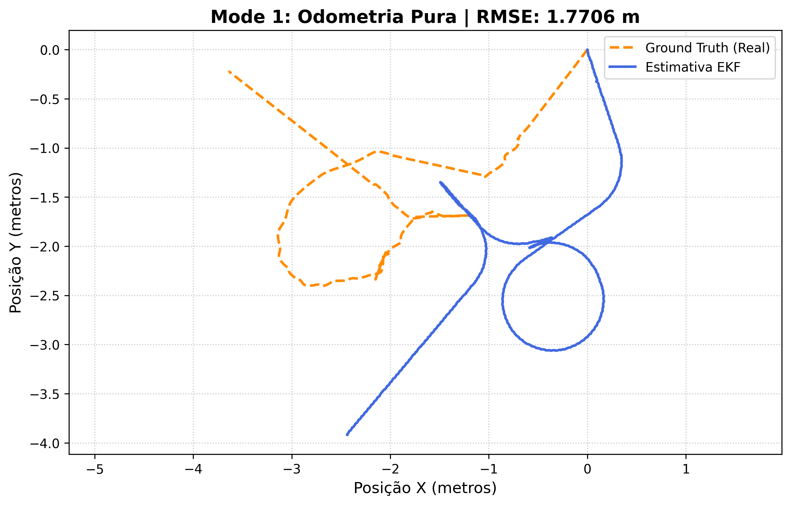
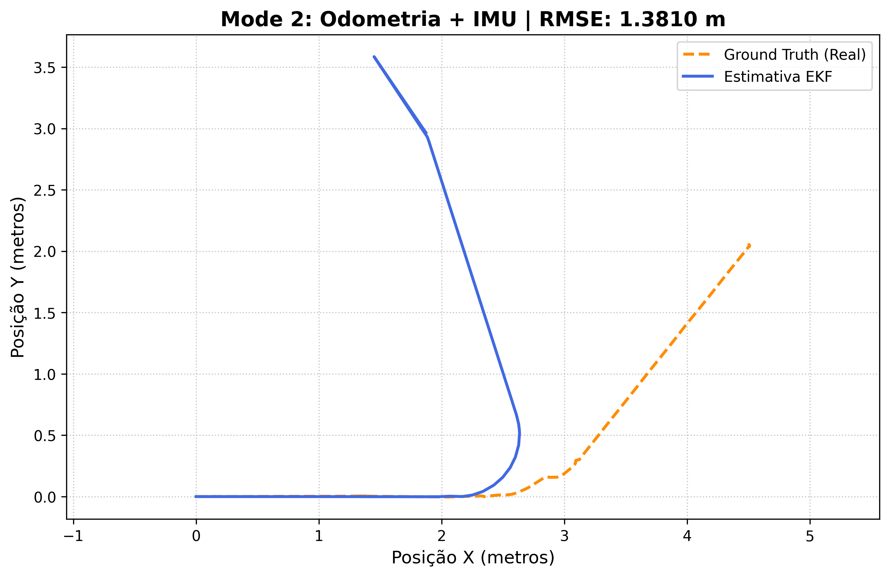
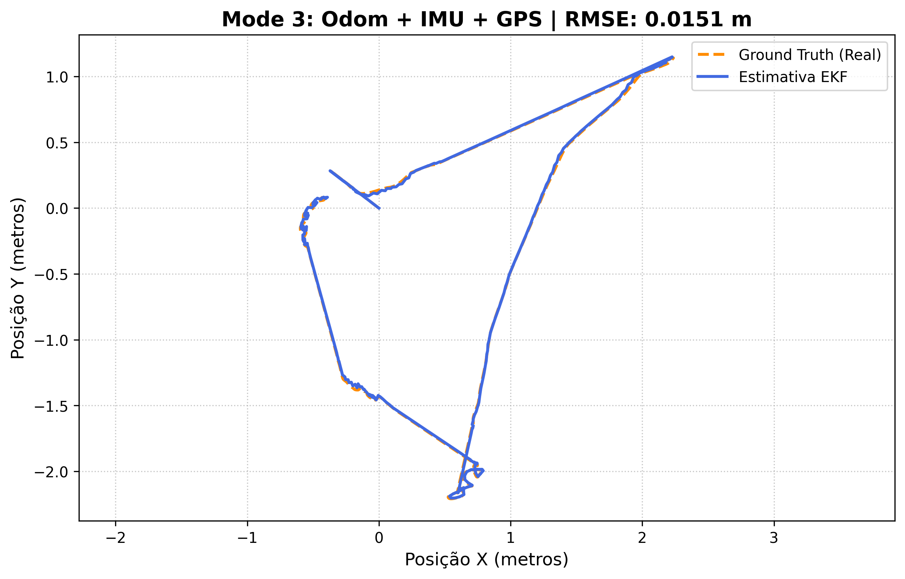

# Sensor Fusion Kalman: Estimação de Estado e Odometria

Este repositório documenta o desenvolvimento e a validação de um sistema de fusão de sensores para robôs móveis, utilizando o pacote `robot_localization` (EKF) do ROS. O projeto compara três estratégias de localização, avaliando o erro médio quadrático (RMSE) em relação ao *Ground Truth* do simulador Gazebo.


## Sobre o Projeto
O objetivo deste trabalho é mitigar a deriva (*drift*) inerente à odometria de rodas através da integração de sensores complementares. Foram implementados três modos de operação:

---

##  Metodologia e Configuração
O sistema utiliza o nó `robot_localization` para fundir dados de sensores com diferentes características de ruído e frequência.

### Configurações de Fusão
1. **Modo 1 (Odometria):** Fusão baseada apenas em `/wheel/odom`,a Odometria Pura (Rodas).
2. **Modo 2 (Odom + IMU):** Inclusão de `/imu/data` para estabilização de orientação, (Fusão inercial para correção de orientação).
3. **Modo 3 (Odom + IMU + GPS):** Inclusão de `/gps/odom` (conversão de coordenadas geodésicas para o plano cartesiano X/Y), (Fusão global para correção de posição absoluta).


### Fluxo de Dados
1. **Sensores e Entradas do EKF:** `/wheel/odom` (encoders), `/imu/data` (aceleração/giro) e `/fix` (GPS).
2. **Pré-processamento:** O GPS (latitude/longitude) é convertido para coordenadas cartesianas locais (X, Y) através de um nó de transformação, gerando o tópico `/gps/odom`.
3. **Fusão (EKF):** O nó `ekf_localization_node` recebe os dados, executa a predição baseada no modelo cinemático e a correção baseada nas medições recebidas.
4. **Referencial:** Definimos `world_frame: odom` para garantir que o robô tenha um referencial estável, com a devida sincronização de *timestamps* via `message_filters`.
5. * **Saída do Filtro:** `/odometry/filtered`
6. **Ground Truth (Referência):** `/gt/odom` (usado exclusivamente para métricas de erro)

---


## 🛠️ Tecnologias Utilizadas
* **ROS (Robot Operating System):** Noetic
* **Simulador:** Gazebo com robô Clearpath Husky
* **Framework:** `robot_localization` (Extended Kalman Filter)
* **Linguagem:** Python (para avaliação de métricas)


##  Estrutura do Repositório
* `/config`: Ficheiros YAML com os parâmetros do EKF (covariâncias e configurações de sensores).
* `/launch`: Scripts de inicialização (`fusion.launch`) com o gerenciamento dos nós.
* `/scripts`: Ferramentas de avaliação (`avaliar_tcc.py`) para processamento de *bags* e geração dos gráficos de trajetória.


## Como Reproduzir
1. Certifique-se de ter o ambiente ROS Noetic instalado.
2. Clone o repositório:
   ```bash
   git clone https://github.com/Eufratica/sensor-fusion-ros.git

## Resultados Experimentais

| Modo 1 (Odometria) | Modo 2 (Odom + IMU) | Modo 3 (Odom + IMU + GPS) |
| :---: | :---: | :---: |
|  |  |  |

> **Análise:** O Modo 3 (Odom + IMU + GPS) atingiu um RMSE de **0.0151 m**, demonstrando a eficácia da fusão sensorial na correção da deriva.

A eficácia da fusão sensorial foi validada através do RMSE, demonstrando a convergência do filtro à medida que mais sensores são integrados:

| Modo | Sensores | RMSE (m) |
| :--- | :--- | :--- |
| **1** | Odometria Pura | 1.7706 |
| **2** | Odometria + IMU | 1.3810 |
| **3** | Odom + IMU + GPS | 0.0151 |

> **Conclusão:** A integração de sensores globais (GPS) com sensores proprioceptivos (Odometria/IMU) demonstrou uma redução crítica no erro, validando a arquitetura proposta para aplicações de navegação autônoma.

---
## Melhorias de Localização:

Do Modo 1 (1.77 m) para o Modo 2 (1.38 m): Aqui a gente atacou a "cegueira angular" do robô. Na odometria pura, o robô só sabe quanto as rodas giraram, mas não sabe se está girando no lugar ou em curva. A IMU traz o dado do giroscópio, que é um sensor inercial. O EKF agora tem uma medição direta da velocidade angular. Isso faz o filtro conseguir "desacoplar" o erro de orientação do erro de translação. O erro cai porque a estimativa de Yaw (o ângulo do robô) fica muito mais estável, evitando que o erro de rotação seja jogado na posição X e Y.

Do Modo 2 (1.38 m) para o Modo 3 (0.015 m): O GPS quebra a principal barreira da robótica móvel: o drift acumulado. Enquanto a odometria e a IMU são sensores que acumulam erros, ou seja, integra o erro a cada segundo, o GPS é uma referência absoluta. 

No Modo 3, o filtro tem a "âncora". Toda vez que o GPS envia uma coordenada, o filtro usa o ganho de Kalman K para dizer: "Olha, a odometria diz que estamos aqui, mas o GPS diz que estamos 2 cm pro lado. Vamos confiar mais no GPS porque ele não deriva". É isso que zera o erro acumulado e faz o RMSE despencar para 1.5 cm.


##  Aprofundamento: Funcionamento do EKF

O sistema opera em um ciclo contínuo de **Predição e Correção**:

1. **Predição:** O robô projeta sua posição futura usando o modelo dinâmico (Odom+IMU). A incerteza (covariância $P$) cresce naturalmente aqui.
2. **Correção:** Quando o GPS envia uma medida ($\mathbf{z}$), o filtro calcula o resíduo e ajusta o estado. Se a confiança no GPS é alta, a estimativa é "puxada" para a coordenada global, reduzindo a incerteza.

### Fatores Chave:
* **Matrizes de Covariância:** Ajustamos o `process_noise_covariance` no arquivo `.yaml` para impedir que o sistema confiasse cegamente em sensores ruidosos.
* **Estimativa de Bias da IMU:** O EKF estima internamente o *bias* (erro constante) da IMU, subtraindo-o em tempo real, o que evita que o robô "dance" quando parado.
* **Sincronização Temporal:** Utilizamos `message_filters` para garantir que o *timestamp* dos tópicos de entrada fosse casado no tempo, evitando erros de "fantasmas" na fusão.

---

Nota: O Ground Truth (/gt/odom) é utilizado estritamente para avaliação. O EKF não tem acesso a este tópico durante o processamento, garantindo que a estimativa de estado seja realizada apenas com sensores embarcados, simulando um cenário real de robótica móvel.
